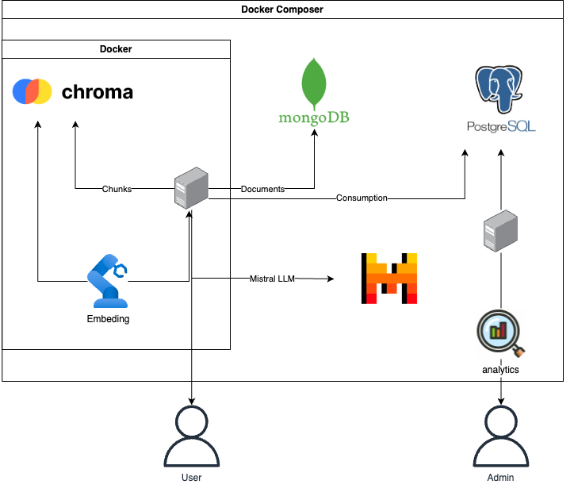

# RePilot Recycle Chatbot 🤖♻️

[](https://opensource.org/licenses/MIT)
[](https://www.python.org/)
[](https://streamlit.io/)
[](https://www.postgresql.org/)
[](https://www.mongodb.com/)
[](https://www.trychroma.com/)
[](https://github.com/BerriAI/litellm)
[](https://www.sbert.net/)
[](https://github.com/your-org/ecologits)
[](https://mistral.ai/)

## Table des matières

- [Présentation](#présentation)
- [Fonctionnalités](#fonctionnalités)
- [Architecture du projet](#architecture-du-projet)
- [Installation](#installation)
- [Utilisation](#utilisation)
- [Contribution](#contribution)
- [Auteurs](#auteurs)

## Présentation

RePilot est un chatbot intelligent spécialisé dans le tri des déchets. Utilisant le RAG (Retrieval-Augmented Generation) et l'API Mistral, il fournit des réponses contextualisées selon la ville de l'utilisateur tout en mesurant son impact environnemental (choix de la taille du modèle).

## Fonctionnalités

- 🎯 **RAG Intelligent**
  - Reformulation automatique des questions
  - Réponses basées sur le contexte local (Système de tri des déchets selon la ville Paris/Grand Métropoel de Lyon)
  - Système de garde-fou pour requêtes inappropriées

- 📊 **Monitoring Complet**
  - Suivi de la latence des requêtes
  - Mesure de l'impact environnemental (GWP)
  - Analyse de la consommation d'énergie
  - Calcul des coûts par requête

- 🗄️ **Choix du Data Warehouse**
  - **PostgreSQL** : Base de données relationnelle puissante pour le scaling
  - **MongoDB** : Base NoSQL adaptée aux instructions de recyclage pour un apprentissage efficace du RAG
  - **ChromaDB** : Stockage des vecteurs (embeddings) en chunks avec SentenceTransformer
  - 
- 🚀 **Quiz :**
- **Questions Personnalisées :**  
  Générées automatiquement à partir de l'historique des interactions de l'utilisateur avec le chatbot.  
- **Reformulation Intelligente :**  
  Les questions sont reformulées par le LLM pour plus de clarté et de pertinence.  
- **Réponses Fausses Générées :**  
  Deux fausses réponses crédibles sont générées par le LLM pour augmenter la difficulté du quiz.  
- **Filtrage par Pertinence :**  
  Les questions non pertinentes sont automatiquement exclues grâce à un score de similarité sémantique (BERTScore).  
- **Suivi des Performances :**  
  Calcul du score final et affichage des résultats détaillés avec un système de feedback visuel.  
- **Analyse des Réponses :**  
  Enregistrement des performances dans la base de données pour des analyses futures
  
- 👥 **Gestion Utilisateurs**
  - Interface admin dédiée
  - Système de quiz interactif
  - Historique des conversations
  - Feedback utilisateur

## Architecture du projet



## Installation
Vous avez deux façons d'initialiser localement le projet

### DOCKER

#### Prérequis

- Docker
- Ficher .env 
```sh
MISTRAL_API_KEY=${MISTRAL_API_KEY}
HF_TOKEN=${HF_TOKEN}
```

```sh
docker compose up --build -d
```
### Local

#### Prérequis

- Python 3.11
- PostgreSQL
- Compte Mistral AI
- Un fichier `.env` contenant vos clés API (par exemple, `MISTRAL_API_KEY`)

#### Étapes d'installation

```bash
# Cloner le dépôt
git clone https://github.com/jdalfons/RePilot-recycle-chatbot.git
cd RePilot-recycle-chatbot

# Créer et activer l'environnement virtuel
python -m venv venv
source venv/bin/activate  # Sur macOS/Linux

# Installer les dépendances
pip install -r requirements.txt
```

#### Configuration de la base de données

```bash
psql -U postgres -f database/init.sql
```

#### Configuration des variables d'environnement

Créer un fichier `.env` et y ajouter les informations suivantes :

```ini
POSTGRES_HOST=localhost
POSTGRES_PORT=5432
POSTGRES_DB=poc_rag
POSTGRES_USER=your_user
POSTGRES_PASSWORD=your_password
MISTRAL_API_KEY=your_api_key
```

### Utilisation

```bash
streamlit run app.py
```

#### Accès

- **Interface utilisateur**  :
  - **Login** : `user`
  - **Password** : `user123`
- **Dashboard admin** :
  - **Login** : `admin`
  - **Password** : `admin123`

## Contribution

1. Forker le projet
2. Créer une branche :

   ```bash
   git checkout -b feature/NouvelleFonctionnalite
   ```

3. Commiter vos modifications :

   ```bash
   git commit -m "Ajout nouvelle fonctionnalité"
   ```

4. Pousser vers le dépôt distant :

   ```bash
   git push origin feature/NouvelleFonctionnalite
   ```

5. Créer une Pull Request

## Auteurs

### Core Team

- [Juan Diego A.](https://github.com/jdalfons) 
- [Quentin Lim](https://github.com/QL2111) 
- [ADJARO](https://github.com/Adjaro) 
- [Akrem Jomaa](https://github.com/akremjomaa) 
- [Yacine Ayachi]()

### Contributions

[](https://github.com/jdalfons/RePilot-recycle-chatbot/graphs/contributors)

_Merci à tous les contributeurs qui ont participé à ce projet !_
